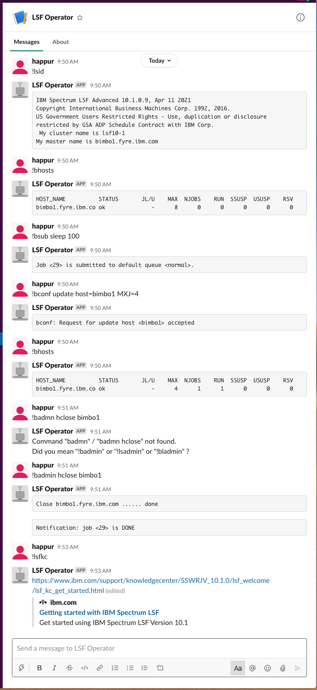

# LSF ChatOps
You can talk to your `LSF` cluster by `Slack` anywhere with `Slack` client installed.

`LSF` chatops uses `Errbot` framework. The `LSF` plugin operates `LSF` cluster based on commands sending from `Slack` client. You can setup `Errbot` with `LSF` plugin to enable `LSF` chatops.

## Setup
You need an admin rights of a `Slack` workspace to create a robot and get the api-token for accessing `Slack` by the robot.
Please refer to `Slack` document to [create a bot for your workspace](https://slack.com/help/articles/115005265703-Create-a-bot-for-your-workspace). When you've already have an robot, you can get the API token from `Slack` app `Manage/Custom Integration/Bots Configurations`. The `API Token` is used by `LSF` plugin to communicte with `Slack` server.

[Errbot](https://github.com/errbotio/errbot) should be installed based on [setup document](https://errbot.readthedocs.io/en/latest/user_guide/setup.html).

After all preparations are done, `LSF` chatops can be deployed with below steps:
1. install `LSF` plugin into your `Errbot` environment 
```
# copy LSF plugin to your Errbot working directory.
cp -R ./plugins/lsf ERRBOT_WORK_DIR/plugins/
```

2. confgiure `config.py` of your `Errbot` environment
```
BACKEND = 'Slack'
BOT_IDENTITY= {
        'token': 'your-robot-token-from-Slack'
}
BOT_ADMINS = ('@your-name', )
```

3. start `errbot` up
```
# source LSF environment
# if cshrc:
# source $LSF_TOP/conf/cshrc.lsf
# if bash:
source $LSF_TOP/conf/profile.lsf
errbot
```

## Usage
All `LSF` commands are converted to `Errbot` commands. So, you can use `LSF` commands with `!` prefixed in your chat box. E.g.`!lsid`.
`LSF` chatops also support below commands:
 - `!lsfkc`: `LSF` knowledge center link for reference
 - `!register [jobid] [@user]`: register notification of job finish event if job is not submitted from `Slack`. When the job is finished, the `user` will be notified.

## Configuration
By default, the robot is running in non-security mode. There is no permission control. If you start up `Errbot` with `LSF` plugin, there is no permission checking for all users doing any `LSF` operations.

If you want to configure accesss control for `Slack` users to use your robot. You need to define `LSF_PLUGIN_TOP` and make sure `config.json` is under the top directory. `config.json` defines the rule of `LSF` plugin.
- administrator: a user who can run administration command lines
- allowlist: `Slack` user list who can talk with the `LSF` cluster
- usermap: `Slack` user is mapped to an OS user. When a job is submitted, mapped user is assigned by `-user` in `bsub` automatically. You should enable [LSB_IMPERSONATION_USERS](https://www.ibm.com/docs/en/spectrum-lsf/10.1.0?topic=kubernetes-installing) featture in your cluster to make user map works.

## Example

